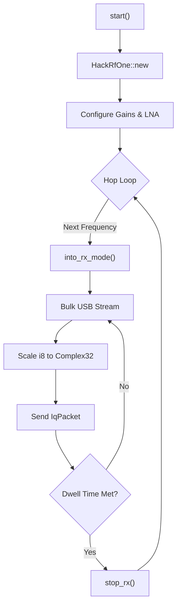

# Design: HackRF One Interface (orecchiette-sdr-hackrf-rs)

This document details the architecture of the `orecchiette-sdr-hackrf-rs` crate, a pure-Rust implementation of the SDR detection applications SDR abstraction layer for the Great Scott Gadgets HackRF One.

## 1. Introduction

The HackRF One is a popular, low-cost SDR transceiver. Unlike traditional integrations that rely on `libhackrf` and `libusb` C-bindings, this crate uses a **100% native Rust stack** (`hackrfone` + `nusb`). This eliminates complex toolchains, avoids FFI boundary issues, and simplifies cross-platform builds across Linux, macOS, and Windows.

## 2. System Architecture

The hardware abstraction centers around a stateful tuning and capture loop.

### State-Machine Transitions
The `hackrfone` crate leverages Rust's typestate pattern to enforce hardware safety. The device cannot be retuned while actively streaming. 
- During a channel hop, the capture thread explicitly drops the RX stream by calling `stop_rx()`.
- It then configures the new center frequency.
- Finally, it transitions back by calling `into_rx_mode()` to resume the USB bulk transfer loop.

## 3. Signal Processing & Limitations

### IQ Scaling
The HackRF ADCs operate at 8-bit precision. The bulk USB stream delivers interleaved `i8` values. The capture thread transparently scales these byte values into floating-point `Complex32` coordinates in the `[-1.0, 1.0)` range, dividing each component by `128.0`.

### Dynamic Range
Because the HackRF provides ~4 fewer bits of dynamic range than a 12-bit SDR (like the USRP B210), weak signal SNR is lower. The backend exposes explicit builder flags to compensate via hardware amplifiers:
- **LNA (IF) Gain**: 0–40 dB in 8 dB steps.
- **VGA (Baseband) Gain**: 0–62 dB in 2 dB steps.
- **AMP Enable**: Toggles the +14 dB front-end RF amplifier (can easily overload on strong ambient ISM traffic).

### USB Constraints and Overruns
The HackRF operates over USB 2.0. At sample rates above 20 MSPS, the bulk transport heavily drops samples.
- **Clamping**: The `start()` function hard-clamps requested sample rates to `20_000_000.0` Hz.
- **Overruns**: The underlying USB bulk read implementation does not surface dropped-sample hardware flags. Consequently, `IqPacket::overrun` is permanently emitted as `false`, and overruns will manifest as silent phase discontinuities rather than triggering orchestrator-level rate step-downs.

### Failure Handling
If every channel in a sweep fails to tune or re-enter RX mode, the hop loop
backs off 500ms and retries. After `MAX_CONSECUTIVE_SWEEP_FAILURES` (10)
consecutive failed sweeps — meaning the device has been unresponsive for at
least ~5 seconds — the capture thread gives up and exits instead of
retrying forever, so `SdrHandle::wait()` eventually returns for a HackRF
that's been unplugged.

